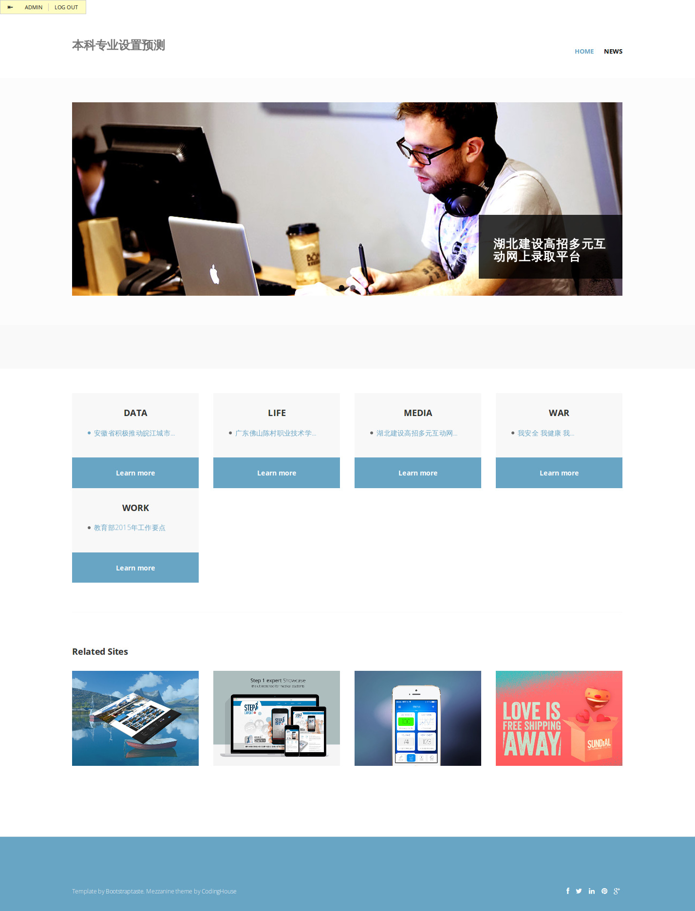

# Requirements

Mezzanine==3.1.10

# Setup

    pip install -r requirements.txt
    python manage.py syncdb
    python manage.py runserver

# Overview

首页和新闻帖子相关代码分别在home和news目录下。
xxx/admin链接进入后台管理。

===============
# 林妹妹任务
- [ ] 相关网站链接（首页上的Related Site），同新闻可在后台添加修改（参考news的实现） <2015-04-10 Fri>--<2015-04-13 Mon>
- [ ] 中文化（参考https://docs.djangoproject.com/en/1.8/topics/i18n/translation/） <2015-04-10 Fri>--TBA
